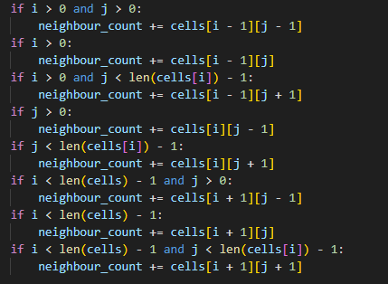
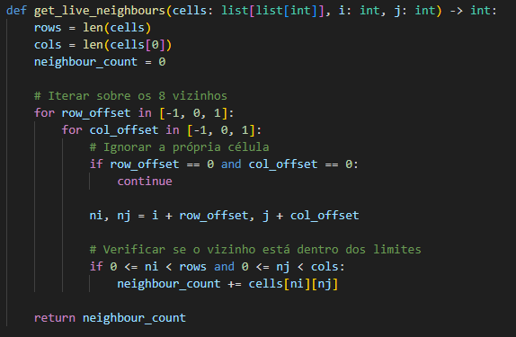
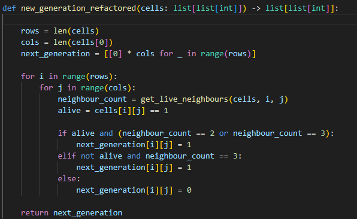
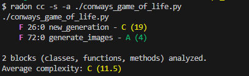
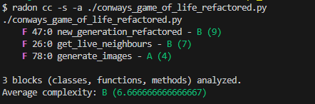

# Instruções de Execução

## Instalação de Dependências

Ambos os scripts utilizam a biblioteca `Pillow` para manipulação de imagens e geração de arquivos GIF. Você deve instalá-la em seu ambiente Python antes de executar os códigos:

```bash
pip install Pillow
```

## Execução dos Códigos

### Execução do Código Original

Para rodar a versão original do algoritmo, execute o seguinte comando:

```bash
python ./conways_game_of_life.py
```

**Output Esperado:** Um arquivo chamado `out.gif` será gerado no diretório de execução.

### Execução do Código Refatorado

Para rodar a versão refatorada do algoritmo, execute o seguinte comando:

```bash
python ./conways_game_of_life_refactored.py
```

**Output Esperado:** Um arquivo chamado `out_refactored.gif` será gerado no diretório de execução.

# Relatório de Refatoração de Complexidade Ciclomática

Este relatório detalha a análise e a refatoração de um algoritmo Python com o objetivo de reduzir sua Complexidade Ciclomática (CC), melhorando assim a manutenibilidade e a clareza do código.

## Projeto Escolhido

O projeto analisado é a implementação do **Jogo da Vida de Conway** (Conway's Game of Life) em Python, proveniente do repositório `TheAlgorithms/Python`, disponível em [https://github.com/TheAlgorithms/Python/blob/master/cellular_automata/conways_game_of_life.py](https://github.com/TheAlgorithms/Python/blob/master/cellular_automata/conways_game_of_life.py)

## Tipo de Manutenção Aplicada

A intervenção realizada no código é classificada como **Manutenção Perfectiva**.

**Justificativa:**
A Manutenção Perfectiva visa aprimorar a qualidade interna do *software* (estrutura, eficiência, manutenibilidade) sem alterar sua funcionalidade externa. A refatoração da função `new_generation` não mudou o resultado final do Jogo da Vida de Conway, mas sim a forma como o cálculo da próxima geração é realizado, tornando o código mais modular e com menor complexidade.

## O que Foi Modificado

A alta Complexidade Ciclomática da função `new_generation` original (CC 19) era causada principalmente pela lógica extensa e repetitiva de verificação manual dos 8 vizinhos de cada célula, com múltiplas instruções condicionais (`if`) para lidar com os limites da matriz.



A modificação consistiu em aplicar o padrão de **Extração de Método** (Extract Method):

1.  **Criação da Função Auxiliar `get_live_neighbours`**: Toda a lógica de contagem de vizinhos foi isolada em uma nova função. Esta função utiliza *loops* aninhados para iterar sobre os 8 vizinhos, simplificando a verificação de limites e a contagem.    


2.  **Refatoração da Função Principal `new_generation_refactored`**: A função principal foi simplificada para focar exclusivamente na aplicação das regras do Jogo da Vida de Conway, delegando a contagem de vizinhos para a nova função auxiliar.    


## Métricas Coletadas (Antes x Depois)

A Complexidade Ciclomática (CC) foi medida utilizando a ferramenta `radon`. A CC é uma métrica que mede o número de caminhos lineares independentes no código, sendo que valores mais baixos indicam maior simplicidade e manutenibilidade.

### Código Original    
  

### Código Refatorado    


### Conclusão da Métrica

A refatoração resultou em uma redução significativa da complexidade média (de **11.5** para **6.6...**), movendo o código da classificação de **Risco Moderado (C)** para **Risco Baixo (B)**. A complexidade total da lógica foi distribuída em duas funções menores e mais coesas, ambas com complexidade gerenciável, o que facilita a leitura, o teste unitário e a manutenção futura do código.
